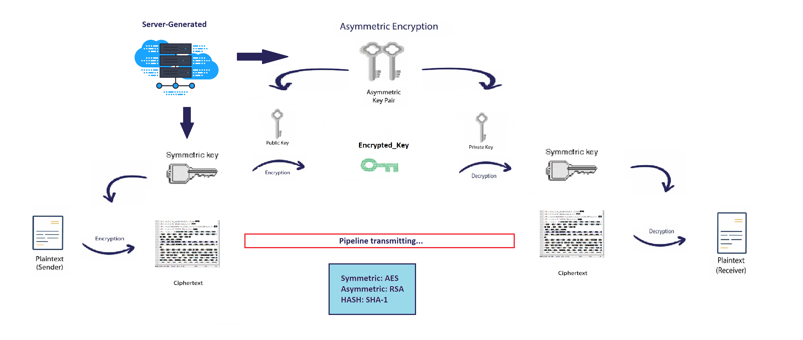
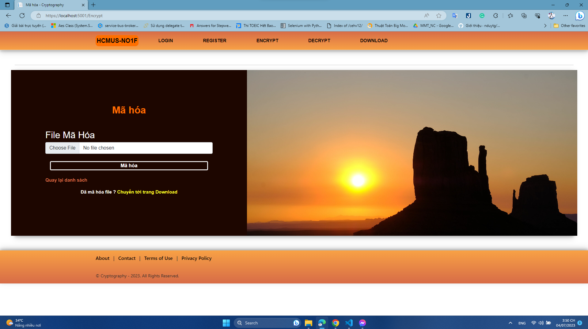
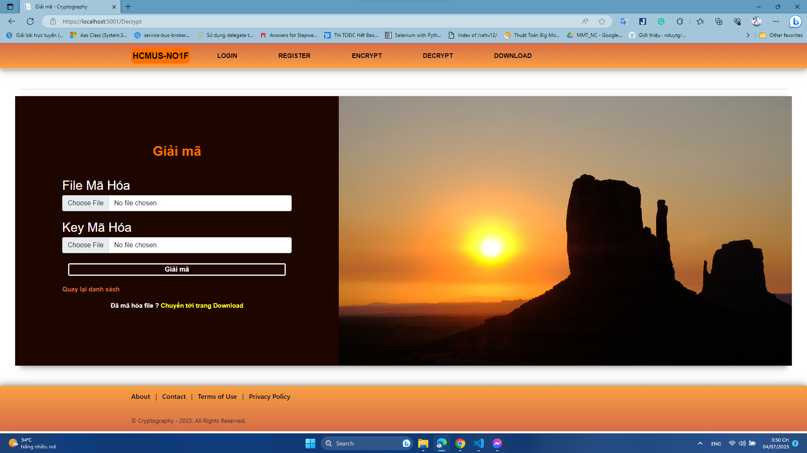

<!--
Hey, thanks for using the awesome-readme-template template.
If you have any enhancements, then fork this project and create a pull request
or just open an issue with the label "enhancement".

Don't forget to give this project a star for additional support ;)
Maybe you can mention me or this repo in the acknowledgements too
-->
<div aligns="center">

  
  <h1>Cryptography-DOTNET</h1>
Webapp used to Encrypt, Decrypt , Digital Sign and Authorization based on ASP.NET 
  <p>
    This is project about encryption and decryption file using ASP.NET with fully support of microsoft library System.Cryptography.Security
  </p>
   <p> 
     Author: Nguyễn Cao Nam Vũ - 20127670
  </p>
  <p>
    Webapp used to Encrypt, Decrypt based on ASP.NET
  </p>
  
  
<!-- Badges -->
<p>
  <a href="https://github.com/NoNameNo1F/Cryptography-DOTNET/graphs/contributors">
    
  </a>
  <a href="">
    
  </a>
  <a href="https://github.com/NoNameNo1F/Cryptography-DOTNET/network/members">
    
  </a>
  <a href="https://github.com/NoNameNo1F/Cryptography-DOTNET/stargazers">
    
  </a>
  <a href="https://github.com/NoNameNo1F/Cryptography-DOTNET/issues/">
    
  </a>
  <a href="https://github.com/NoNameNo1F/Cryptography-DOTNET/blob/master/LICENSE">
    
  </a>
</p>
   
<h4>
    <a href="https://github.com/NoNameNo1F/Cryptography-DOTNET/">View Demo</a>
  <span> · </span>
    <a href="https://github.com/NoNameNo1F/Cryptography-DOTNET/">Documentation</a>
  <span> · </span>
    <a href="https://github.com/NoNameNo1F/Cryptography-DOTNET/issues/">Report Bug</a>
  <span> · </span>
    <a href="https://github.com/NoNameNo1F/Cryptography-DOTNET/issues/">Request Feature</a>
  </h4>
</div>

<br />

<!-- Table of Contents -->

# :notebook_with_decorative_cover: Table of Contents

- [About the Project](#star2-about-the-project)
  - [Screenshots](#camera-screenshots)
  - [Tech Stack](#space_invader-tech-stack)
  - [Features](#dart-features)
  - [Color Reference](#art-color-reference)
- [Getting Started](#toolbox-getting-started)
  - [Prerequisites](#bangbang-prerequisites)
  - [Run Locally](#running-run-locally)
- [Usage](#eyes-usage)
- [Contributing](#wave-contributing)
- [License](#warning-license)
- [Contact](#handshake-contact)
- [Acknowledgements](#gem-acknowledgements)
- [Documentation](#book-documentation)

<!-- About the Project -->

## :star2: About the Project

<!-- Screenshots -->

### :camera: Screenshots

#### :Cách Hoạt Động

<div aligns="center"> 
  
</div>

#### :Mã Hóa

<div aligns="center"> 
  
</div>

#### :Giải Mã

<div aligns="center"> 
  
</div>

<!-- TechStack -->

### :space_invader: Tech Stack

<details>
  <summary>Client</summary>
  <ul>
    <li><a href="https://dotnet.microsoft.com/en-us/"> DOTNET</a></li>
  </ul>
</details>

<details>
  <summary>Server</summary>
  <ul>
    <li><a href="https://dotnet.microsoft.com/en-us/"> DOT NET</a></li>
  </ul>
</details>

<details>
<summary>Mssql(Current not used)</summary>
</details>

<details>
<summary>Publish on github</summary>
<ul>
    <li><a href="https://github.com/NoNameNo1F/Cryptography-DOTNET"> DOT NET</a></li>
  </ul>
</details>

<!-- Features -->

### :dart: Features

- Encrypting File
- Decrypting File
- Hashing Key Encrypt-File
- Download File

<!-- Color Reference -->

### :art: Color Reference

| Color           | Hex                                                              |
| --------------- | ---------------------------------------------------------------- |
| Primary Color   |  #d76c47 |
| Secondary Color |  #FFD95C |
| Accent Color    |  #FFFFFF |
| Text Color      |  #240700 |

<!-- Getting Started -->

## :toolbox: Getting Started

<!-- Prerequisites -->

### :bangbang: Prerequisites

Install and setup environment dotnet to run this project, keep up-to-date .NET version 7

```bash
  dotnet-install.sh --runtime dotnet --version 7.0.5
  dotnet-install.sh --sdk dotnet --version 7.0.5

  or
  dotnet tool update --global dotnet-ef --version 7.0.5
```


<!-- Run Locally -->

### :running: Run Locally

Clone the project

```bash
  git clone https://github.com/NoNameNo1F/Cryptography-DOTNET.git
```

Go to the project directory

```bash
  cd Cryptography-DOTNET
```

Install dependencies

```bash
  dotnet build
```

Start the server

```bash
  dotnet watch run
  or
  dotnet run
```

<!-- Usage -->

## :eyes: Usage

This project is only for demonstration SSO based-on Open Source: Keycloak, which uses Identify Provider for authentication user login after User is authenticated they can use the application.
This project is relative to my prj that i'm solo with this: it's only for encrypt and decrypt file.

<!-- Contributing -->

## :wave: Contributing

<a href="https://github.com/NoNameNo1F/Cryptography-DOTNET/graphs/contributors">
  
</a>

Contributions are always welcome!

See `contributing.md` for ways to get started.

<!-- License -->

## :warning: License

Distributed under the no License. See LICENSE.txt for more information.

<!-- Contact -->

## :handshake: Contact

Nguyễn Cao Nam Vũ - [Linkedin](linkedin.com/in/vu-nguyen-a61a83235) - NoNameNo1F@gmail.com

Project Link: [https://github.com/NoNameNo1F/Cryptography-DOTNET](https://github.com/NoNameNo1F/Cryptography-DOTNET)

Mail for me - [NoNameNo1F](https://mail.google.com/mail/u/1/?view=cm&fs=1&to=NoNameNo1F@gmail.com&tf=1) 

<!-- Acknowledgments -->

## :gem: Acknowledgements

- [Awesome README](https://github.com/Louis3797/awesome-readme-template)

<!-- Documentation -->

## :book: Documentation

Due to based on framework documentation , and fully support by microsoft 

- [DOTNET](https://dotnet.microsoft.com/en-us/)
- [System.Security.Cryptography](https://learn.microsoft.com/en-us/dotnet/api/system.security.cryptography?view=net-7.0)
- [AES-Documentation](https://learn.microsoft.com/en-us/dotnet/api/system.security.cryptography.aes?view=net-7.0)
- [RSA-Documentation](https://learn.microsoft.com/en-us/dotnet/api/system.security.cryptography.rsa?view=net-7.0)
